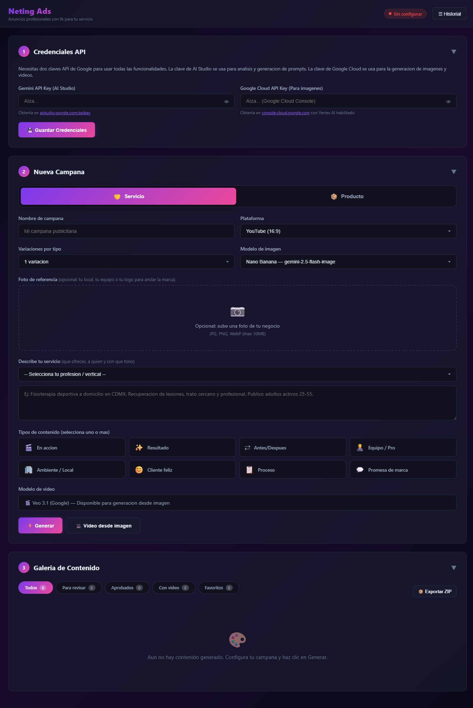

# Neting Ads · Anuncios con IA para tu servicio

> Herramienta para los miembros de **Neting Roma Condesa**. Genera imágenes y video publicitario para tu **servicio** profesional a partir de una descripción (y, opcionalmente, una foto de tu negocio).

**🔗 App en vivo:** https://cmedelortega.github.io/neting-ads

## ¿Para quién es?

Para profesionales de servicios: fisioterapia, dental, inmobiliaria, seguros, finanzas, coaching, construcción, imprenta, cocina saludable, viajes, arte y tecnología. Cada vertical viene **precargada** con su tono, escenario y tipos de contenido recomendados.

## Cómo se usa (3 pasos)

1. **Configura tus claves de Google** (una sola vez, se guardan en tu navegador):
   - Gemini API Key — gratis en https://aistudio.google.com/apikey
   - Google Cloud API Key (para imágenes/video) — https://console.cloud.google.com con Vertex AI habilitado
2. **Describe tu servicio** o elige tu vertical en el desplegable. Opcional: sube una foto de tu local, tu equipo o tu logo para que los anuncios se parezcan a tu marca real.
3. **Elige los tipos de contenido y genera.** Revisa, marca favoritos, genera video desde cualquier imagen y descarga todo en ZIP.

## Modo Servicio vs. Modo Producto

La app tiene dos modos (arriba en "Nueva Campaña"):
- **Servicio** (por defecto): el protagonista es la experiencia, el resultado y las personas. Tipos: En acción, Resultado, Antes/Después, Equipo, Ambiente, Cliente feliz, Proceso, Promesa de marca.
- **Producto**: para quien vende productos físicos. Tipos: Product Shot, Lifestyle, Flat Lay, Unboxing, etc.

## Notas

- Las claves API se quedan en tu navegador (`localStorage`). Nadie más las ve.
- El uso de los modelos de Google puede generar costos en tu cuenta según el volumen.
- Las personas y lugares generados son ilustrativos por IA; para máxima fidelidad, sube una foto real de tu negocio.

---

*Construido con desarrollo asistido por IA · Para la comunidad Neting Roma Condesa.*
